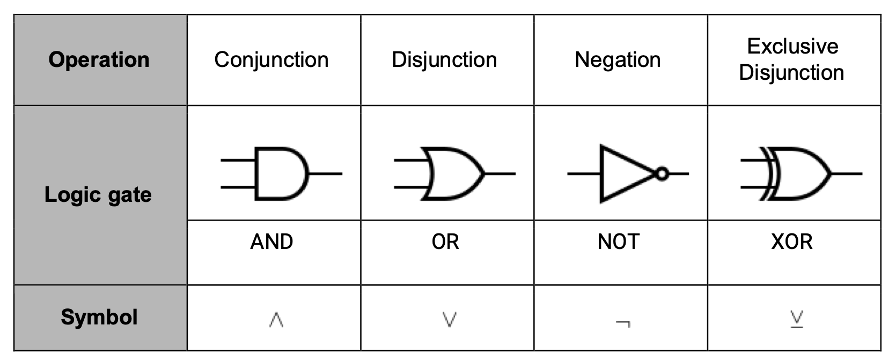

# Boolean Algebra


Boolean algebra is the manipulation of logical values.

>  [!INFO]
> There are always 2^n output combinations for the total inputs n.

## Logic Gates
There are 4 gates.



### AND
- If both inputs are 1, then it outputs a 1
- Symbol of ``^``

```

--- |--\
    |   D ---
--- |--/
```

### OR

- If either input is 1, then the output is 1
- Symbol of ``v``

```
--- |--\
     \   \
      }   } ------ 
     /   / 
--- |--/
```

### NOT
- Inverts the input
- Symbol of ``¬``

```
   |\
-- | >o ----
   |/
```


### XOR
- Same as OR, but if both are 1, then return 0
- Notated as an underlined v
```
--- | |--\
    |  \   \
     }  }   } ------ 
    |  /   / 
--- | |--/
(Or but with an extra curved line on the input side.)
```

### NAND
> [!NOTE]
> This isn't on the spec
- Equal to !(A^B)

## Order precedence
The order of operations matters, similarly to maths.  
The sequence is:
- Brackets
- Not
- And
- Or


## Laws of Boolean Algebra


### Associative law
The associative law states that for 3 items and only one operator

### de Morgan's law
De Morgan's law states that:
```
¬(A v B) = ¬A ^ ¬B

¬(A ^ B) = ¬A v ¬B
```

> [!NOTE]
> You could think of this as distributing the ¬ symbol to the AND/OR, as well as the conditions.

This result can be proved with a truth table.

### Distributive law:
The distributive law states that boolean algebra can be expanded out.

```
A ^ (B v C) = (A^B) v (A^C)
A v (B^C) = (A v B) ^ (A v C)
```

### Absorptive law

```
A v (A^B^...) = A 
A ^ (A v B v ...) = A
```

## Karnaugh map
A karnaugh map is similar to a truth table, where it represents all of the possible outputs for possible inputs.  
However, instead of a table, it is a grid, where the rows and columns are labelled with the possible inputs.
Karnaugh maps are much closer to normal tables, and are easier to read than truth tables.

|A/B|0|1|
|-|-|-|
|0|0|0|
|1|0|1|

In a Karnaugh map, there is a correct order for what the left side should look like. One bit should be different from the previous rows.
For example:
|A/B|00|01|11|10|
|-|-|-|-|-|
|00|0|0|0|0|
|01|0|0|0|0|
|11|0|0|0|0|
|10|0|0|0|0|
^ Notice how the A/B column only differs by one bit each time.

Given the example: P = !C^DvA^B

|.|A^B|00|01|11|10| 
|-|-|-|-|-|-|
|!C^D|.| . | . | . |
|00|.|0|0|0|0|
|01|.|1|1|1|1|
|11|.|0|0|0|0|
|10|.|0|0|0|0|

To reverse a KM:
1. Group the adjacent 1s as big as they can be
  - The groups must be minimised
  - Groups must be of size $2^n$ where n is a whole number
2. Ensure the groups are distinguishable
3. Find the expression for each group
3. Apply an OR to each group to combine them into the final condition

# Logic Gates
## Half Adder
A half adder is a circuit that adds 2 bits together, and outputs the sum and carry.  
This is done by combining an XOR and AND gate together with inputs A and B.
It looks like this:


The half adder cannot take in an input carry bit. It will only produce an output carry.

## Full Adder
A full adder is a circuit that is capable of taking in a carry bit, and adding it to the sum of 2 bits.
By combining the output of one half adder with another half adder (and an additional OR for the carry in) it can correctly account for the carry in.


